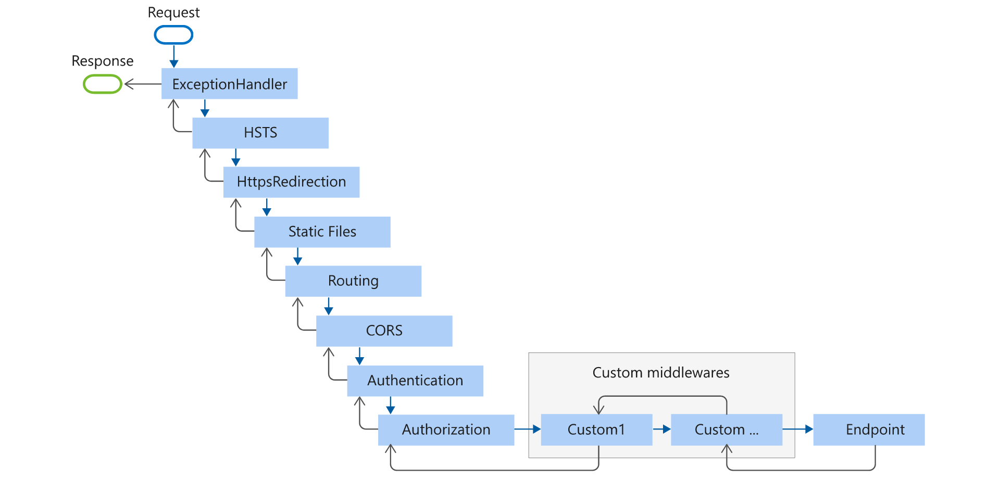

# [Middleware](https://docs.microsoft.com/en-us/aspnet/core/fundamentals/middleware)

Middleware is software that's assembled into an app pipeline to handle requests and responses. Each component:

- Chooses whether to pass the request to the next component in the pipeline.
- Can perform work before and after the next component in the pipeline.

Request delegates are used to build the request pipeline. The request delegates handle each HTTP request.

Request delegates are configured using [Run][Run_docs], [Map][Map_docs], and [Use][Use_docs] extension methods.

An individual request delegate can be specified in-line as an anonymous method (called in-line middleware), or it can be defined in a reusable class.
These reusable classes and in-line anonymous methods are *middleware*, also called *middleware components*.

Each middleware component in the request pipeline is responsible for invoking the next component in the pipeline or short-circuiting the pipeline.
When a middleware short-circuits, it's called a *terminal middleware* because it prevents further middleware from processing the request.

[Use_docs]: https://docs.microsoft.com/en-us/dotnet/api/microsoft.aspnetcore.builder.useextensions.use
[Run_docs]: https://docs.microsoft.com/en-us/dotnet/api/microsoft.aspnetcore.builder.runextensions.run
[Map_docs]: https://docs.microsoft.com/en-us/dotnet/api/microsoft.aspnetcore.builder.mapextensions.map

## Middleware Pipeline

The ASP.NET Core request pipeline consists of a sequence of request delegates, called one after the other.


Each delegate can perform operations before and after the next delegate. Exception-handling delegates should be called early in the pipeline, so they can catch exceptions that occur in later stages of the pipeline. It's possible to chain multiple request delegates together with `Use`.

The *next* parameter represents the next delegate in the pipeline. It's possible to short-circuit the pipeline by *not calling* the next parameter.
When a delegate doesn't pass a request to the next delegate, it's called *short-circuiting the request pipeline*.
Short-circuiting is often desirable because it avoids unnecessary work.

It's possible to perform actions both *before* and *after* the next delegate:

```cs
public class Startup
{
    public void Configure(IApplicationBuilder app)
    {
        // "inline" middleware, best if in own class
        app.Use(async (context, next) =>
        {
            // Do work that doesn't write to the Response.
            await next.Invoke();
            // Do logging or other work that doesn't write to the Response.
        });
    }
}
```

`Run` delegates don't receive a next parameter. The first `Run` delegate is always terminal and terminates the pipeline.

```cs
public class Startup
{
    public void Configure(IApplicationBuilder app)
    {
        // "inline" middleware, best if in own class
        app.Use(async (context, next) =>
        {
            // Do work that doesn't write to the Response.
            await next.Invoke();
            // Do logging or other work that doesn't write to the Response.
        });

        app.Run(async context =>
        {
            // no invocation of next
        });
    }
}
```

## Middleware Order




The Endpoint middleware executes the filter pipeline for the corresponding app type.

The order that middleware components are added in the `Startup.Configure` method defines the order in which the middleware components are invoked on requests and the reverse order for the response. The order is **critical** for security, performance, and functionality.

```cs
public void Configure(IApplicationBuilder app, IWebHostEnvironment env)
{
    if (env.IsDevelopment())
    {
        app.UseDeveloperExceptionPage();
        app.UseDatabaseErrorPage();
    }
    else
    {
        app.UseExceptionHandler("/Error");
        app.UseHsts();
    }

    app.UseHttpsRedirection();
    app.UseStaticFiles();
    // app.UseCookiePolicy();

    app.UseRouting();
    // app.UseRequestLocalization();
    // app.UseCors();

    app.UseAuthentication();
    app.UseAuthorization();
    // app.UseSession();
    // app.UseResponseCompression();
    // app.UseResponseCaching();

    app.UseEndpoints(endpoints =>
    {
        endpoints.MapRazorPages();
        endpoints.MapControllerRoute(
            name: "default",
            pattern: "{controller=Home}/{action=Index}/{id?}");
    });
}
```

[Built-in Middleware](https://docs.microsoft.com/en-us/aspnet/core/fundamentals/middleware/#built-in-middleware)

## Branching the Middleware Pipeline

`Map` extensions are used as a convention for branching the pipeline. `Map` branches the request pipeline based on matches of the given request path.
If the request path starts with the given path, the branch is executed.

When `Map` is used, the matched path segments are removed from `HttpRequest.Path` and appended to `HttpRequest.PathBase` for each request.

`MapWhen` branches the request pipeline based on the result of the given predicate.
Any *predicate* of type `Func<HttpContext, bool>` can be used to map requests to a new branch of the pipeline.

`UseWhen` also branches the request pipeline based on the result of the given predicate.
Unlike with `MapWhen`, this branch is rejoined to the main pipeline if it doesn't short-circuit or contain a terminal middleware.

## Custom Middleware Classes

Middleware is generally encapsulated in a class and exposed with an extension method.

```cs
using Microsoft.AspNetCore.Http;
using System.Globalization;
using System.Threading.Tasks;

namespace <App>
{
    public class CustomMiddleware
    {
        private readonly RequestDelegate _next;

        public CustomMiddleware(RequestDelegate next)
        {
            _next = next;
        }

        public async Task InvokeAsync(HttpContext context)
        {
            // Do work that doesn't write to the Response.
            await _next(context);  // Call the next delegate/middleware in the pipeline
            // Do logging or other work that doesn't write to the Response.
        }
    }
}
```

The middleware class **must** include:

- A public constructor with a parameter of type [RequestDelegate][RequestDelegate_docs].
- A public method named `Invoke` or `InvokeAsync`. This method must:
  - Return a `Task`.
  - Accept a first parameter of type [HttpContext][HttpConrext_Docs].

[RequestDelegate_docs]: https://docs.microsoft.com/en-us/dotnet/api/microsoft.aspnetcore.http.requestdelegate
[HttpConrext_Docs]: https://docs.microsoft.com/en-us/dotnet/api/microsoft.aspnetcore.http.httpcontext

## Middleware Extension Methods

```cs
using Microsoft.AspNetCore.Builder;

namespace <App>
{
    public static class MiddlewareExtensions
    {
        public static IApplicationBuilder UseCustom(this IApplicationBuilder builder)
        {
            return builder.UseMiddleware<CustomMiddleware>();
        }
    }
}
```

```cs
// This method gets called by the runtime. Use this method to configure the HTTP request pipeline.
public void Configure(IApplicationBuilder app, IWebHostEnvironment env)
{
    // other middlewares

    app.UseCustom();  // add custom middleware in the pipeline

    app.UseEndpoints(endpoints =>
    {
        endpoints.MapControllers();
    });
}
```
