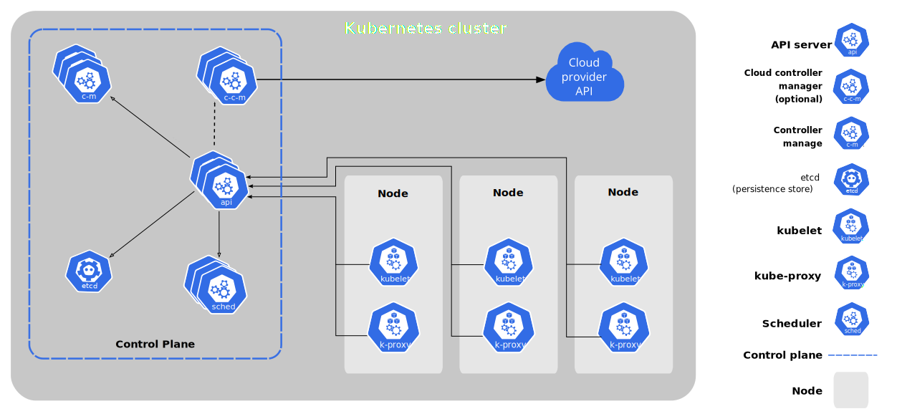

# Kubernetes (`k8s`)

## Cluster Architecture

A Kubernetes **cluster** consists of a set of worker machines, called **nodes**, that run _containerized_ applications. Every cluster has at least one worker node.

The worker node(s) host the **pods** that are the components of the application workload. The **control plane** manages the worker nodes and the pods in the cluster.  
In production environments, the control plane usually runs across multiple computers and a cluster usually runs multiple nodes, providing fault-tolerance and high availability.



### Control Plane

The control plane is the container orchestration layer that exposes the API and interfaces to define, deploy, and manage the lifecycle of containers. It's components are:

- **kube-apiserver**: entrypoint of the cluster that exposes the kubernetes API
- **kube-controller-manager**: keeps track of what is happening in the cluster
- **kube-scheduler**: ensures pod placement on the nodes based on node resource availability
- **etcd**: key-value store used as Kubernetes backing store for all cluster data

> **Note**: in production environment there are _at least_ two control planes to ensure constant availability of their functionalities

### Node

Nodes are the worker machines in kubernetes. The node components are:

- **kubelet**: the agent that runs on each node in the cluster. It makes sure that containers are running in a pod
- **kube-proxy**: the network proxy part of the cluster _virtual network_ that allows communication to pods from inside or outside of the cluster
- **container runtime**: the software that is responsible for running containers

## Kubernetes Components

### Pod

**Pods** are the smallest unit in kubernetes. They are an abstraction over a set of running containers. The pod abstraction is used to make kubernetes independent from the container technology.

Each pod has it's own IP address inside the virtual network of the cluster; this makes pod communication possible.  
Since pods are _ephemeral_ resources when a pod dies another one will replace it. The new pod will get a new IP address.

### Service

**Services** are permanent IP addresses and ar used to resolve the issue of changing pod IPs. Each pod can be attached to a service. The lifecycle of a service is detached from a pod.  
_External_ services are used to make the contents of a pod accessible from the outside of the cluster while _internal_ services are not exposed.

### Ingress

**Ingresses** are the components hat forwards external requests to specific services. Ingresses are used to expose services through secure protocols and friendly URLs instead of service IPs.

### ConfigMap

**ConfigMaps** are external configurations used to store non-confidential data in key-value pairs. Pods can consume ConfigMaps as environment variables, command-line arguments, or as configuration files in a volume.

ConfigMaps allow to decouple environment-specific configuration from container images, so that applications are easily portable.

### Secret

**Secrets** contains a small amount of sensitive data such as a password, a token, or a key. Such information might otherwise be put in a Pod specification or in a container image.

Secrets are similar to ConfigMaps but are specifically intended to hold confidential data.

Because Secrets can be created independently of the Pods that use them, there is less risk of the Secret (and its data) being exposed during the workflow of creating, viewing, and editing Pods.  

> **Warn**: secrets, by default, are _not_ encrypted: they are stored in base64. Consider using third-party encryption tools.

### Volumes

**Volumes** are physical storage attached to a pod in order to persist data when a pod is shut down.

> **Warn**: kubernetes dows not manage data persistance. Backups must be managed externally.

### Deployment

**Deployments** are a description of the _desired state_ of the cluster. The _deployment controller_ changes the actual state to match the desired one.

Deployments can be used to manage the scaling of the replicas of a pod.

### ReplicaSet

**ReplicaSets** are groups of identical pods and are used to guarantee the availability of the replicated application. ReplicaSets are used to manage _stateless_ applications.

### StatefulSet

**StatefulSets** are group of pods with guarantees about the _ordering_ and _uniqueness_ of the pods. StatefulSets are used to manage pods that need consistent state like databases.

### DaemonSet

**DaemonSets** ensure the _all or some_ nodes in a cluster run a copy of a specific pod.

### Jobs

**Jobs** create one or more Pods and will continue to retry execution of the Pods until a specified number of them successfully terminate.

As pods successfully complete, the Job tracks the successful completions. When a specified number of successful completions is reached, the task is complete.

---

## Kubernetes Configuration

Each kubernetes configuration file is composed by 3 parts:

- metadata
- specification
- status (generated by k8s)

> **Note**: kubernetes config files are written in YAML

---

## `kubectl`

### `kubectl get`

```sh
kubectl config get-contexts  # list available contexts

kubectl get namespaces  # list namespaces inside current context

kubectl get pod -n|--namespace <namespace>  # list pods inside namespace
kubectl get pod [-n|--namespace <namespace>] <pod> -o|--output jsonpath='{.spec.containers[*].name}'  # list containers inside pod
```

### `kubectl exec`

```sh
kubectl exec [-i|--stdin] [-t|--tty] [-n|--namespace <namespace>] <pod> [-c|--container <container>] -- <command>  # execute a command inside a container
```

### `kubectl logs`

```sh
kubectl logs [-f|--follow] [-n|--namespace <namespace>] <pod> [-c|--container]  # get pod/container logs
```
