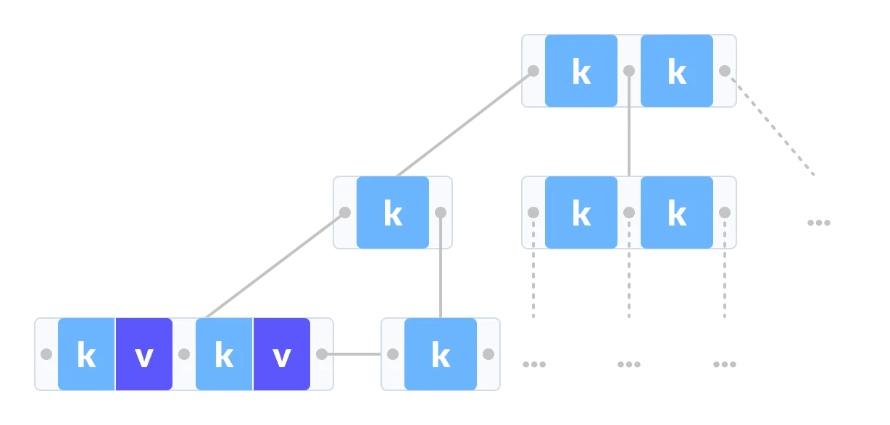
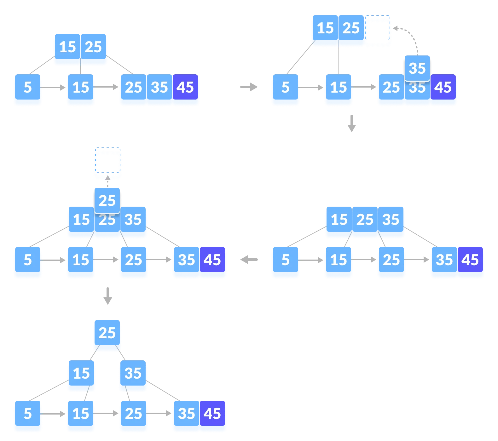
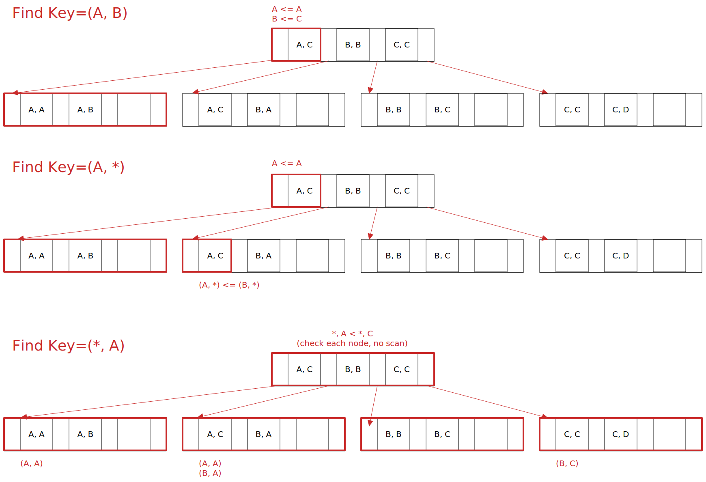

# Indexes & B+Trees

## B+Tree

[B+Tree Visualization](https://www.cs.usfca.edu/~galles/visualization/BPlusTree.html "B+Tree Visualization")

A **B+Tree** is a self-balancing tree data structure that keeps data sorted and allows searches, sequential access, insertions and deletions always in `O(log n)`.  
It's a generalization of a binary search tree, since a node can have more than two children. It's optimized for systems that need to read and write large blocks of data.

A B+Tree is an `M`-way search tree with the following properties:

- It's perfectly balanced (every leaf node is at the same depth).
- Every node other than the root is at least half-full (`(M/2)-1 <= #keys <= M-1`).
- Every inner node with `k` keys has `k+1` non-null children.

### Nodes

Every B+Tree node is comprised if an array of key-value pairs. The keys are derived from the attribute(s) that the index is based on. The values will differ based on whether the node is classified as an _inner node_ or a _leaf node_.

The arrays are (usually) kept in sorted key order.

Leaf node values:

- **Record ID**: pointer to the location of the tuple to which the index entry corresponds.
- **Tuple Data**: the leaf node stores the actual contents of the tuple. Secondary indexes must store the record id a their values.

> **Note**: if the workload is mostly primary key lookup then prefer index with tuple data. If the workload has several secondary key lookups prefer record ids. Tuple data indexes need a double search for secondary keys since a secondary index will return a primary key to be searched again in the primary index.

### B-Tree bs B+Tree

The **B-Tree** stores keys and values in all nodes of the tree. It's more space-efficient since each key only appears once in the tree.

A **B+Tree** only stores values in leaf nodes, inner nodes only guide the search process. Since the values are in a linked list at the bottom of the tree a sequential scan does not need to jump around the tree.

### Insertion

Find leaf node in which the entry belongs.

- **Case 1**: If the leaf is not full, insert the key into the leaf node in increasing order. Done.
- **Case 2**: If the leaf is full, insert the key into the leaf node in increasing order and balance the tree:
  1. Break the node at `M/2`th position. New leaf contains `M/2`..`M-1` nodes.
  2. Add `M/2`th key to the parent node as well.
  3. If the parent node is already full, follow steps 2 to 3.

> **Note** B+Trees grow at the root and not at the leaves.

### Deletion

Find leaf node in which the entry belongs and remove the entry.

- **Case 1**: The leaf has more than `M/2` entries. Done.
- **Case 2**: The leaf has only `(M/2)-1` entries. Two options:
  - re-distribute borrowing from sibling, update parent if needed.
  - merge with sibling, must delete entry from parent.

> **Note**: merging can bubble up and reduce the depth of the tree.

### Key Lookups

A DBMS can use a B+Tree index if the query provides any of the attributes of the search key. For an hash index all attributes of the key are needed.

> **Note**: not all DBMSs support partial key lookup if the leading attribute is missing

### Duplicate Keys

- **Append Record Id**: Add the tuple's unique record id as part of the key to ensure all keys are unique. The DBMS can still use partial keys to find tuples.
- **Overflow Leaf Nodes**: Allow leaf nodes to split into overflow nodes that contain the duplicate keys (more complex to maintain and modify).
