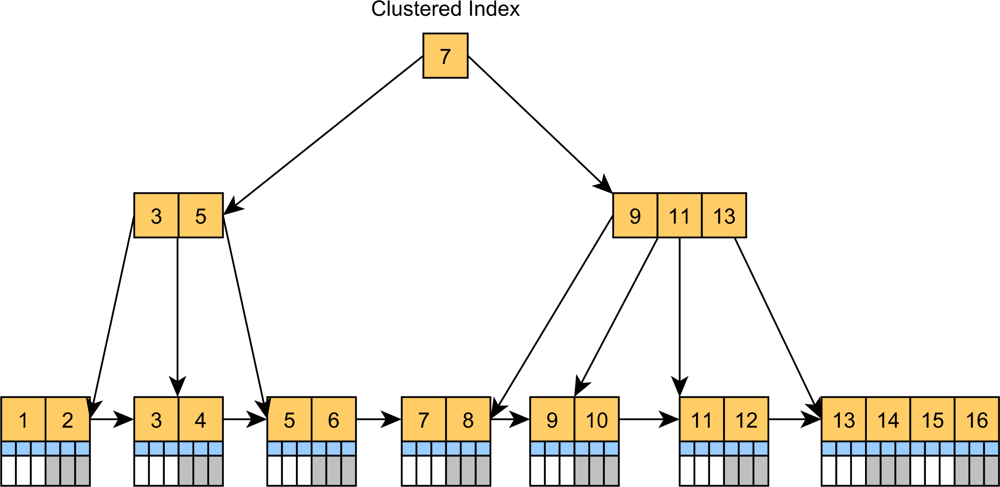
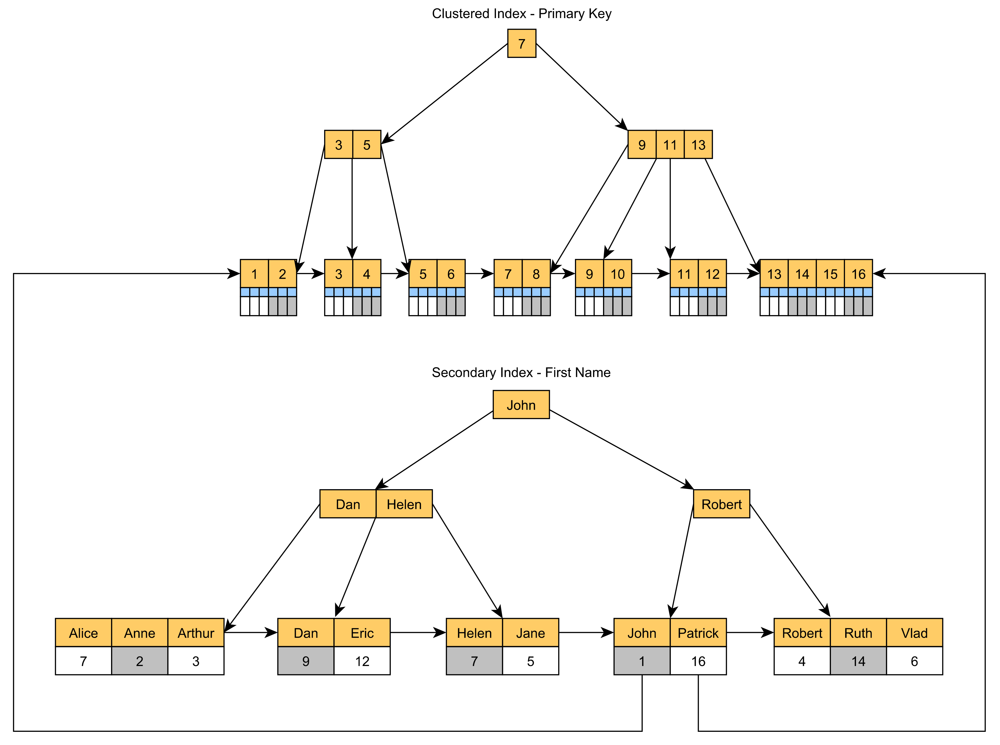

# Table Indexes

A **table index** is a replica of a subset of a table's attributes that are organized and/or sorted for efficient access using those attributes. The DBMS ensures that the contents of the table and the index are synchronized.

There is a trade-off regarding the number of indexes to create per databases:

- storage overhead
- maintenance overhead

## Clustered Indexes

A **Clustered Index** is a tree-organized table. Instead of storing the records in an unsorted Heap table space, the clustered index is actually a B+Tree index having the _leaf nodes_, which are stored in the sort order specified by the _primary key_, store the actual table records.

The Clustered Index can speed up queries that filter records by the clustered index key, like the usual CRUD statements.  
Since the records are located in the leaf nodes, there's no additional lookup for extra column values when locating records by their Primary Key values.

Retrieving tuples in the order they appear in a non-clustered index is inefficient due to redundant reads. Since the index leafs point to pages in random order a page can be retrieved from disk multiple times for a single query.

The DBMS must first figure out all the tuples it needs and then sort them based on page id to maximize read efficiency.

## Index Concurrency Control

A DBMS needs to allow multiple workers (threads or precesses) to safely access data structures to take advantage of additional CPU cores and hide disk I/O stalls.

A **concurrency control** protocol is the method that the DBMS uses to ensure "correct" results for concurrent operations on a shared object.

A protocol correctness criteria can vary:

- **Logical Correctness**: can a thread see the data that is supposed to see?
- **Physical Correctness**: is the internal representation of the object sound?

### Locks vs Latches

Locks (Transactions):

- Protect the database's logical contents from other transactions.
- Held for transaction duration.
- Need to be able to rollback changes

Latches (Workers):

- Protect the critical sections of the DBMS's internal data structure from other workers.
- Held for operation duration.
- Do not need to be able to rollback changes.

| What        | Locks                                | Latches                   |
|:-----------:|:------------------------------------:|:-------------------------:|
| Separate... | Transactions                         | Workers                   |
| Protect...  | Database Contents                    | In-Memory Data Structures |
| During...   | Entire Transactions                  | Critical Sections         |
| Modes...    | Shared, Exclusive, Update, Intention | Read, Write               |
| Deadlock... | Detection % Resolution               | Avoidance                 |
| ...by...    | Waits-for, Timeouts, Aborts          | Coding Discipline         |
| Kept in...  | Lock Manager                         | Protected Data Structure  |

### Latch Modes

**Read Mode**:

- Multiple threads can read the same object at the same time
- A thread can acquire the read latch if another thread has it in read mode

**Write Mode**:

- Only one thread can access the object
- A thread cannot acquire a write latch if another thread has it in any mode

### Latch Implementation

Goals:

- Small memory footprint
- Fast execution path with no contention
- De-schedule thread when it has been waiting for too long to avoid burning cycles
- Each latch should not have to implement their own queue to track waiting threads

Types:

- Test-and-Set Spinlock
- Blocking OS Mutex
- Reader-Writer Lock
