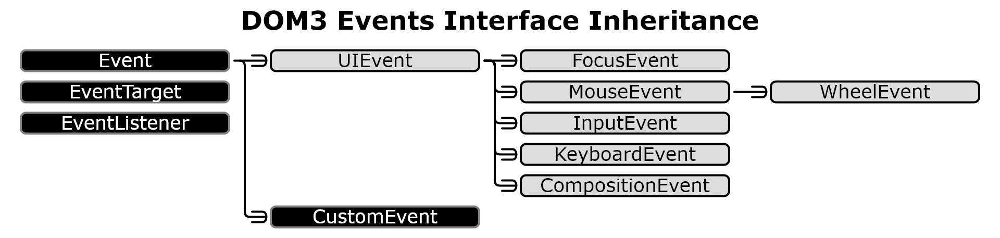

= Events & Animation
:source-highlighter: highlight.js

== Events

Event Types:

* *Mouse Events*: `+mousedown+`, `+mouseup+`, `+click+`, `+dbclick+`,
`+mousemove+`, `+mouseover+`, `+mousewheel+`, `+mouseout+`,
`+contextmenu+`, …
* *Touch Events*: `+touchstart+`, `+touchmove+`, `+touchend+`,
`+touchcancel+`, …
* *Keyboard Events*: `+keydown+`, `+keypress+`, `+keyup+`, …
* *Form Events*: `+focus+`, `+blur+`, `+change+`, `+submit+`, …
* *Window Events*: `+scroll+`, `+resize+`, `+hashchange+`, `+load+`,
`+unload+`, …

== Managing Event Listeners

[source,js]
----
var domNode = document.getElementById("id");

var onEvent = function(event) {  // parameter contains info on the triggered event
    event.preventDefault();  // block execution of default action
    // logic here
}

domNode.addEventListener(eventType, callback);
domNode.removeEventListener(eventType, callback);
----

== Bubbling & Capturing

Events in Javascript propagate through the DOM tree.

https://javascript.info/bubbling-and-capturing[Bubbling and Capturing]
https://www.sitepoint.com/event-bubbling-javascript/[What Is Event
Bubbling in JavaScript? Event Propagation Explained]

== Dispatching Custom Events

Event Options:

* `+bubbles+` (bool): whether the event propagates through bubbling
* `+cancellable+` (bool): if `+true+` the "`default action`" may be
prevented

[source,js]
----
let event = new Event(type [,options]);  // create the event, type can be custom
let event = new CustomEvent(type, { detail: /* custom data */ });  // create event w/ custom data
domNode.dispatchEvent(event);  // launch the event
----

.Event Inheritance

== Animation

The window object is the assumed global object on a page.

Animation in JavascriptThe standard way to animate in JS is to use
window methods. It’s possible to animate CSS styles to change size,
transparency, position, color, etc.

[source,js]
----
//Calls a function once after a delay
window.setTimeout(callbackFunction, delayMilliseconds);

//Calls a function repeatedly, with specified interval between each call
window.setInterval(callbackFunction, delayMilliseconds);

//To stop an animation store the timer into a variable and clear it
window.clearTimeout(timer);
window.clearInterval(timer);

// execute a callback at each frame
window.requestAnimationFrame(callbackFunction);
----

== Element Position & dimensions

https://stackoverflow.com/a/294273/8319610[StackOverflow]
https://stackoverflow.com/a/46772849/8319610[Wrong dimensions at
runtime]

[source,js]
----
> console.log(document.getElementById('id').getBoundingClientRect());
DOMRect {
    bottom: 177,
    height: 54.7,
    left: 278.5,​
    right: 909.5,
    top: 122.3,
    width: 631,
    x: 278.5,
    y: 122.3,
}
----
