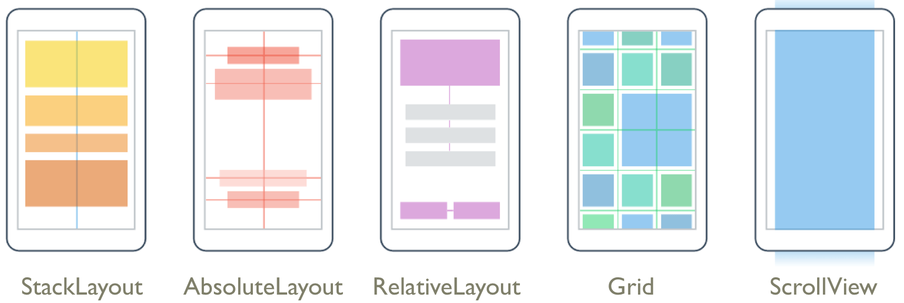

# Page.xaml

## Anatomy of an app

The modern user interface is constructed from visual objects of various sorts. Depending on the operating system, these visual objects might go by different names—controls, elements, views, widgets—but they are all devoted to the jobs of presentation or interaction or both.

In Xamarin.Forms, the objects that appear on the screen are collectively called *visual elements* (`VisualElement` class).

They come in three main categories:

- page (`Page` class)
- layout (`Layout` class)
- view (`View` class)

A Xamarin.Forms application consists of one or more pages. A page usually occupies all (or at least a large area) of the screen.
Some applications consist of only a single page, while others allow navigating between multiple pages.

On each page, the visual elements are organized in a parent-child hierarchy.
Some layouts have a single child, but many layouts have multiple children that the layout arranges within itself. These children can be other layouts or views.

The term *view* in Xamarin.Forms denotes familiar types of presentation and interactive objects.

## Pages


```xml
<?xml version="1.0" encoding="utf-8" ?>

<!-- Sets the Content property to a single View -->
<ContentPage></ContentPage>

<!-- Manages two panes of information (Master and Detail property) -->
<MasterDetailPage></MasterDetailPage>

<!-- Manages navigation among other pages using a stack-based architecture -->
<NavigationPage></NavigationPage>

<!-- Allows navigation among child pages using tabs -->
<TabbedPage></TabbedPage>

<!-- Displays full-screen content with a control template -->
<TemplatePage></TemplatePage>

<!-- Allows navigation among child pages through finger swiping -->
<CarouselPage></CarouselPage>
```

## Layouts



- StackLayout: Organizes views linearly, either horizontally or vertically.
- AbsoluteLayout: Organizes views by setting coordinates & size in terms of absolute values or ratios.
- RelativeLayout: Organizes views by setting constraints relative to their parent's dimensions & position.
- Grid: Organizes views in a grid of Rows and Columns
- FlexLayout: Organizes views horizontally or vertically with wrapping.
- ScrollView: Layout that's capable of scrolling its content.

### Grid Layout

```xml
<!-- "<num>*" makes the dimensions proportional -->
<Gird.RowDefinitions>
    <!-- insert a row in the layout -->
    <RowDefinition Height="2*"/>
</Gird.RowDefinitions>

<Grid.ColumnDefinitions>
    <!-- insert column in layout -->
    <ColumnDefinition Width=".5*"/>
</Grid.ColumnDefinitions>
```

## [Views](https://docs.microsoft.com/en-us/xamarin/xamarin-forms/xaml/xaml-controls "XAML Views")

```xml
<Image Source="" BackgroundColor="" [LayoutPosition]/>
<!-- source contains reference to image file in Xamarin.[OS]/Resources/drawable -->

<!-- box to insert text -->
<Editor Placeholder="placeholder text" [LayoutPosition]/>

<!-- clickable button -->
<Button Text="button text" BackgroundColor="" Clicked="function_to_call" [LayoutPosition]/>
```
